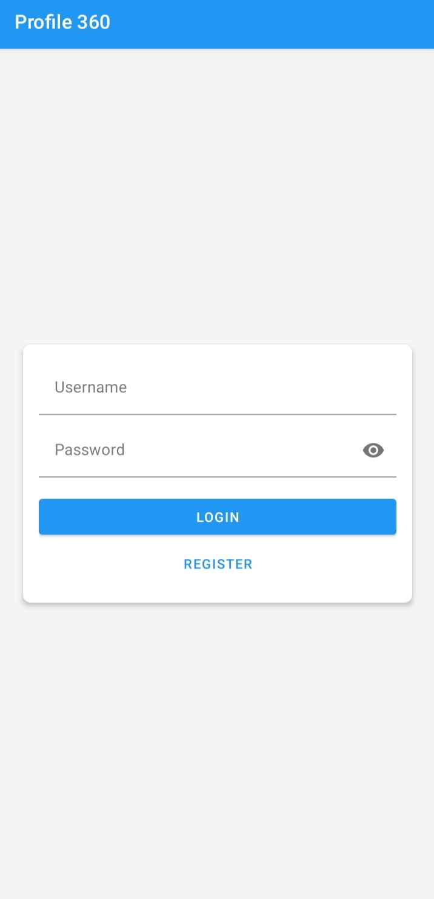
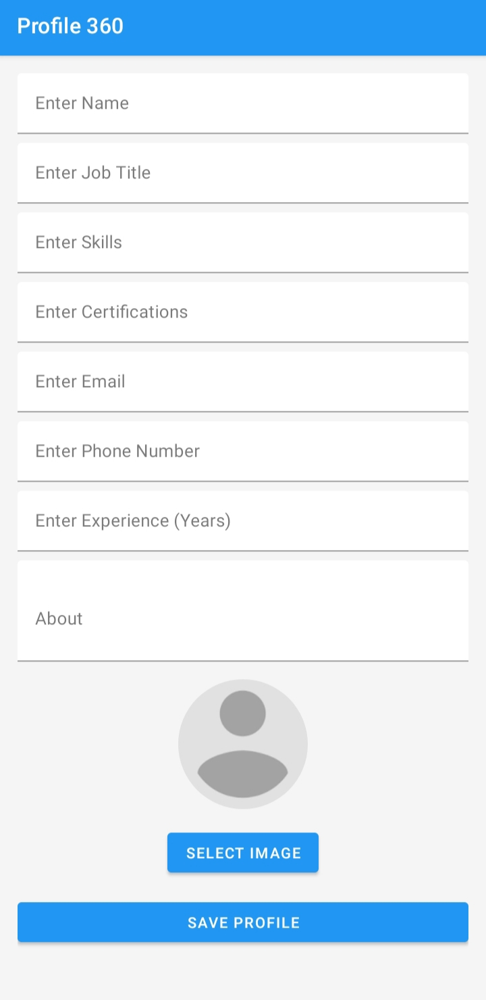
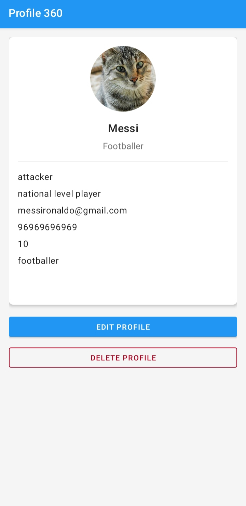

# Profile360

Profile360 is a mobile application designed to streamline staff profile management within organizations. The app provides a centralized platform for storing and accessing employee information, skills, and achievements, enhancing connectivity and collaboration among teams.

## 📱 Screenshots

<div align="center">
  
  
  
  
</div>

## ✨ Features

- **Comprehensive Profiles**: Staff bios, roles, skills, certifications, and contact details
- **Search & Filter**: Easily locate team members by name
- **Achievements Display**: Showcase certifications and accomplishments
- **Profile Photo Updates**: Allow staff to upload and update profile pictures
- **Secure Data Management**: Robust security features, including user authentication and role-based access control

## 🛠️ Technology Stack

- **Frontend**: XML and Java for building a responsive Android user interface
- **Backend**: Java for API management and backend operations
- **Database**: Firebase for dynamic and secure storage of user data and certificates
- **Security**: Authentication mechanisms and access control to ensure data privacy

## 📥 Installation

1. **Clone the Repository**:
   ```bash
   git clone https://github.com/gokul-s05/profile360.git
   cd profile360
   ```

2. **Set Up Firebase**:
   - Create a Firebase project and configure authentication and database rules
   - Download the `google-services.json` file and place it in the `app/` directory

3. **Build the Project**:
   - Open the project in Android Studio
   - Sync the Gradle files
   - Build and run the application on an emulator or physical device

## 🚀 Usage

### Sign In/Sign Up
- Log in with email and password or sign up for a new account

### Create/Update Profiles
- Add or update profile details, including:
  - Name and role
  - Contact information
  - Skills and certifications
  - Profile photo

### Search and Filter
- Use the search bar to find employees by name
- Filter profiles based on various criteria

## 🔒 Security Features

- Secure user authentication
- Password encryption
- Role-based access control
- Data validation and sanitization

## 📱 Supported Android Versions

- Minimum SDK: API 21 (Android 5.0)
- Target SDK: API 34 (Android 14)

## 🤝 Contributing

Contributions are welcome! Please feel free to submit a Pull Request.

## 📄 License

This project is licensed under the MIT License - see the [LICENSE](LICENSE) file for details.


